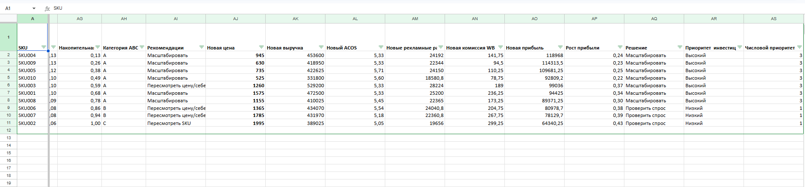

ВБ анализ

Описание проекта
Проект посвящен анализу продаж и эффективности рекламы  товаров маркетплейсов
Цель анализа - выявить прибыльные товары, оценить эффективность рекламных кампаний и определить точки роста прибылт

Что было сделано
Расчет unit-экономики товаров(выручка, себестоимость, прибыль)
Анализ эффективности рекламы(CTR, CPC, ACOS)
Анализ воронки продаж  (просмотры - уклики- заказы)
АВС- анализ ассортимента по доле прибыли
Pareto-анализ для выявления ключевых товаров
Модель роста прибыли (изменение  цены и ACOS)
Формирование матрицы решений  по SKU

Основные метрики 

Общая выручка: 4 089 300	
Общая прибыль: 724 236	
Средняя маржинальность: 17,9%	
Средний ACOS: 6,7%	

Ключевые выводы
Основная прибыль сосредоточена в товарах категории А
Несколько SKU имеют высокий потенциал маштабирования
Оптимизация ACOS  и корректировка цены способны увеличить прибыль по SKU на 22-43 %
Для части товаров требуется пересмотр ценовой стратегии

Инструменты 

Google Sheets  
Excel  
ABC-анализ  
Pareto-анализ  
Unit-экономика  
Анализ рекламных метрик

---

Файл проекта 

ВБ-анализ.xlsx`

Дашборд анализа 

Матрица эффективности SKU

Матрица решений по товарам 

